# Foundations of the theory

Contents:
1. [Volumetric titration](#1-volumetric-titration)
2. [Coulometric titration](#2-coulometric-titration)

## 1. Volumetric titration

Material was taken from the paper:

    EVALUATION OF THE ACID-BASE PROPERTIES OF FULVIC ACIDS USING PK SPECTROSCOPY
    Ryazanov M.A., Zlobin D.A., Lodygin E.D., Beznosikov V.A.
    Eurasian Soil Science. 2001. Т. 34. № 8. С. 830-836.

Plenty of calculation methods were suggested for treatment of curves of the potentiometric titration. But all of them have either unstable solutions and usually suitable for the simplest (binary) systems or require the preliminary information about the dissociation constants of components. 

It was suggested recently to use methods of analysis capable to calculate a distribution function of concentrations of ionogenic groups of the titrated object for the values of pK(-lgK) of an acid dissociation from the curve of acid-base titration. This function was called pK-spectrum, and approach itself was called pK-spectroscopy. The solutions are being found not as the discrete dissociation constants, but as the functions of distribution of concentrations of the ionogenic groups over the continuous spectrum of dissociation constants. 

Such distribution in contrast with the classical methods of potentiometric analysis allows to conduct researches of the complex mixtures of acids and bases with close enough values of the dissociation constants and define both concentrations of components and pK values simultaneously.

A method based on this distribution (method of pK-spectroscopy) is promising for the researches of complex acid-base systems like soil solutions, humic and fulvic acids, ion exchange resins, chemically modified silica, and other systems without reliable information about the functional content and hardly suitable for the classical methods of analysis not always giving the reliable information about their structure.

Actually, methods of pK-spectroscopy used for an acid-base titration allows to investigate any systems exhibiting acid-base properties, e.g. soil solutions, humic, and fulvic acids. pK-spectrum helps to find the total concentrations of components and also to find a qualitative representation about a degree of the energetic heterogeneity of system.

Calculation of pK-spectrum based on the results of potentiometric titration of a mix of acids.

In case of a solution containing m weak monobasic acids (HAi) with the dissociation constants Ki

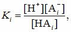 (1)

which is being titrated by a solution of the monoacidic base BOH with the concentration CB. In any moment of titration the condition of electroneutrality of a titrated solution has to be respected. E.g. the overall amount of the single-charged cations must be equal to the overall amount of the single-charged anions  

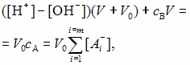 (2)

where *V*0 - volume of the acid solution taken for the titration; *V* - volume of added basic solution; *с*А - total concentration of the "free" anions appeared in a solution during the dissociation of molecules of weak acids in the titrated solution. From equation (2) we obtain

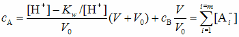 (3)

where *К*w - ionic product of water at 25°С.

On the other side, total concentration of the anions of monobasic acids in solution is equal 

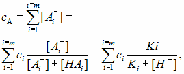 (4) or

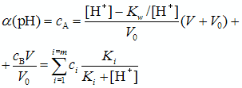 (5)

where *с*i - molar concentration of the acid HAi in a mix. Value α(рН) we may call a titration function.

If only one acid exists in the solution an equation (5) can be transformed

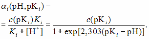 (6)

In the model of continuous distribution over the dissociation constants (pK values) the equation (6) can be transformed

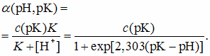 (7)

and a distribution function of groups ρ(рК) is added, so the value of ρ(рК)dpК is a probability of pK value located in the range between pK and pK + dpK. According to the normalization condition 

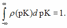 (8)

An average value of every experimentally found function is defined as

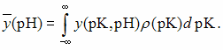 (9)

So, the function of titration and its dependence on pH can be defined from the distribution function of the ionogenic groups over the pK values

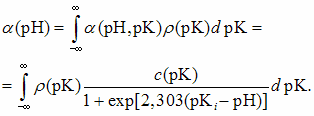 (10)

Value of ρ(рК) can be approximated with the discrete spectrum of Dirac's delta functions as

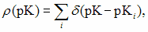 (11)

where the summation goes over all possible real values of pKi

By substituting equation (11) in equation (10) we obtain

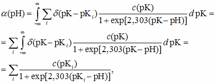 (12)

which is equal to equation (5). The summation in this equation must include all range of possible values of pKi. Left side of this equation contains an experimentally defined titration function α(рН). Right side of the equation contains unknown concentrations of acids c(рКi), characterized by the correspondent values of рКi. The value of c(рКi) does not relate to the strictly defined values of pKi in the real case, but it is a continuous function of pK symmetric over the value of pKi due to the buffer properties of the respective solutions. 

Concentrations c(рКi) can be in principle found as a result of solution of the equation system (12) with different values of pH. But one should keep in mind that this task belongs to the class of mathematically incorrect tasks that can bring a solution highly sensitive to the errors in the source experimental data, so, the errors in the titration function. The stability of solution can be increased with the a priori data about the results, in particular, the values of c(рКi) must be positive.

Estimation of values of pK from the pK-spectrum can be done using the formula of the averaged value

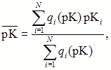 (13)

where 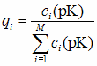 - adjacent non-zero values of molar fractions for the specified pK, interpreted as a single peak; рКi - their respective values of pK; M = (pKmax - pKmin)/ΔpK - number of segments ΔрК wide (basis step рК) over the predefined range of рК; N - number of adjacent non-zero values of qi.

Concentration of acids (ionogenic groups) can be defined with the following equation:

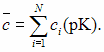 (14)

Standard deviation can be found with the formula

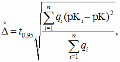 (15)

where *t*0,95 - Student's coefficient for the unconditional probability р = 0,95.

Obtained results of the calculation of pK-spectra from the experimental data of titration of the solutions of weak acids and their mixes show that adjacent non-zero values of qi must be interpreted as a single peak with a maximum presenting the individual component of a system. The resolution of this method with such approach is limited by the basis step of pK (ΔрК). It is advised to select this step as small as possible to improve the resolution. But the stability of solution of system (12) decreases with the smaller steps from the mathematical point of view. 

## 2. Coulometric titration

In case of the coulometric titration equation (5) can be rewritten as:

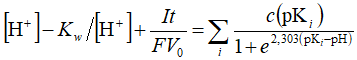 (16)

where *I* - current,
*t* - analysis time,
*F* - Faraday's constant.