# Основы теории

Материал взят из статьи:

Рязанов М. А., Лодыгин Е. Д., Безносиков В. А., Злобин Д. А. Использование метода рK-спектроскопии для оценки кислотно-основных свойств фульвокислот //Почвоведение, 2001, № 8, с. 934-941.

Для обработки кривых потенциометрического титрования предложено множество расчетных методов. Однако все они отличаются либо низкой устойчивостью решений и, как правило, применимы лишь к наиболее простым (двухкомпонентным) системам, либо требуют предварительной информации о величинах констант диссоциации компонентов.

В последнее время для потенциометрического анализа сложных протолитических систем предложено использовать методы обработки данных, позволяющих из кривой кислотно-основного титрования рассчитать функцию распределения концентраций ионогенных групп титруемого объекта по величинам pK(-lgK) кислотной диссоциации. Такая функция распределения названа рК-спектром, а сам подход - рК-спектроскопией. В этом случае решения находят не в виде дискретных констант диссоциации, а в виде функции распределения концентраций ионогенных групп по непрерывному спектру констант диссоциации.

Такое распределение, в отличие от классических методов потенциометрического анализа, позволяет проводить исследования сложных смесей кислот и оснований с достаточно близкими значениями констант диссоциации и одновременно определять как концентрации компонентов, так и величины их рК.

Метод, основанный на таком распределении (метод рК-спектроскопии), перспективен при исследовании сложных кислотно-основных систем: почвенных растворов, гуминовых (ГК) и фульвокислот (ФК), ионообменных смол, химически модифицированных кремнеземов и других, т.е. систем, для которых отсутствуют достоверные данные о функциональном составе и для которых классические методы анализа трудноприменимы и не всегда дают адекватную информацию об их структуре.

Вообще методы рК-спектроскопии, применимые к кислотно-основному титрованию, позволяют исследовать любые системы, проявляющие кислотно-основные свойства, например, почвенные растворы, гуминовые и фульвокислоты. С помощью рК-спектра можно определять общие концентрации компонентов, а также получать качественное представление о степени энергетической неоднородности системы.

Построение рК-спектров по результатам потенциометрического титрования смеси кислот. В случае раствора, содержащего m слабых одноосновных кислот (НАi), характеризующихся константами диссоциации Кi,

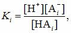 (1)

который титруется раствором одноосновного основания ВОН с концентрацией сB. В любой момент титрования должно выполняться условие электронейтральности титруемого раствора, т.е. общее число однозарядных катионов должно равняться общему числу однозарядных анионов

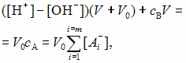 (2)

где V0 - объем раствора кислот, взятого для титрования; V - объем добавленного раствора основания; сА - общая концентрация "свободных" анионов, появившихся в растворе в результате диссоциации молекул слабых кислот в титруемом растворе. Из уравнения (2) получаем

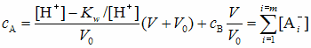 (3)

где Кw - ионное произведение воды при 25°С.

С другой стороны, общая концентрация анионов одноосновных кислот в растворе равна

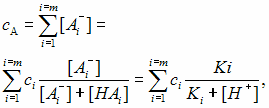 (4) или

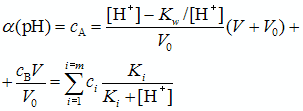 (5)

где сi - молярная концентрация кислоты НАi в смеси. Величину α(рН) будем называть функцией титрования.

Если в растворе присутствует только одна кислота, то уравнение (5) принимает вид

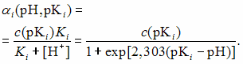 (6)

В модели непрерывного распределения ионогенных групп по константам диссоциации (по величинам рК) уравнение (6) принимает вид

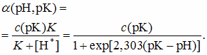 (7)

и вводится функция распределения групп ρ(рК) такая, что величина ρ(рК)dpК представляет собой вероятность того, что величина рК лежит в интервале между рК и рК + dpК. В соответствии с условием нормировки

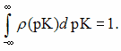 (8)

Среднее значение любой функции, определяемое экспериментально, по определению имеет вид

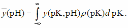 (9)

Таким образом, зная функцию распределения ионогенных групп по величинам рК, можно определить, например, функцию титрования и ее зависимость от рН

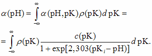 (10)

Величину ρ(рК) можно аппроксимировать дискретным спектром дельта-функций Дирака в виде

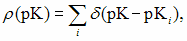 (11)

где суммирование проводится по всем возможным реальным значениям рКi.

Подставляя уравнение (11) в уравнение (10), получаем

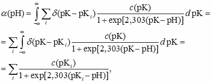 (12)

которое соответствует уравнению (5). Суммирование в этом уравнении должно включать весь интервал возможных значений рКi. В левой части этого уравнения стоит экспериментально определяемая функция титрования α(рН). Правая часть уравнения содержит неизвестные концентрации кислот c(рКi), характеризуемые соответствующим значением рКi. В реальном случае величина c(рКi) относится не к строго определенным значениям рКi , а в силу буферных свойств соответствующих растворов является непрерывной функцией рК, симметричной относительно величины рКi.

Концентрации c(рКi) могут быть в принципе найдены в результате решения системы уравнений (12) при различных значениях рН. Однако
следует иметь в виду, что подобная задача относится к классу некорректных (в математическом смысле) задач, решение которых оказывается крайне чувствительным к небольшим ошибкам в исходных экспериментальных данных, то есть ошибкам в функции титрования. Устойчивость решения к экспериментальным ошибкам повышается, если использовать априорные сведения о получаемых результатах, в частности, очевидно, что величины c(рКi) должны быть положительными.

Расчет величин рК по рК-спектру может быть проведен по формуле для нахождения средневзвешенного значения величины

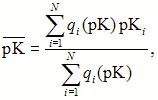 (13)

где 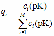 - соседние ненулевые значения мольных долей при заданных рК, интерпретируемые нами как единый пик; рКi - соответствующие им величины pK; M = (pKmax - pKmin)/ΔpK - количество отрезков шириной ΔрК (шаг базиса рК) на заданном интервале рК; N - количество соседних ненулевых значений qi.

Концентрацию кислот (ионогенных групп) рассчитывается по следующему соотношению:

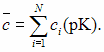 (14)

Стандартное отклонение рассчитыется по формуле

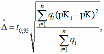 (15)

где t0,95 - коэффициент Стьюдента для доверительной вероятности р = 0,95.

Полученные результаты построения рК-спектров по экспериментальным кривым титрования растворов слабых кислот и их смесей показывают, что соседние ненулевые значения qi следует интерпретировать как единый пик спектра, максимум которого характеризует индивидуальный компонент системы. При таком подходе разрешающая способность данного метода ограничена величиной шага базиса рК (ΔрК). Поэтому для повышения разрешающей способности этот шаг следует выбирать как можно меньше. Однако с точки зрения математики, при уменьшении шага устойчивость решения системы (12) ухудшается.